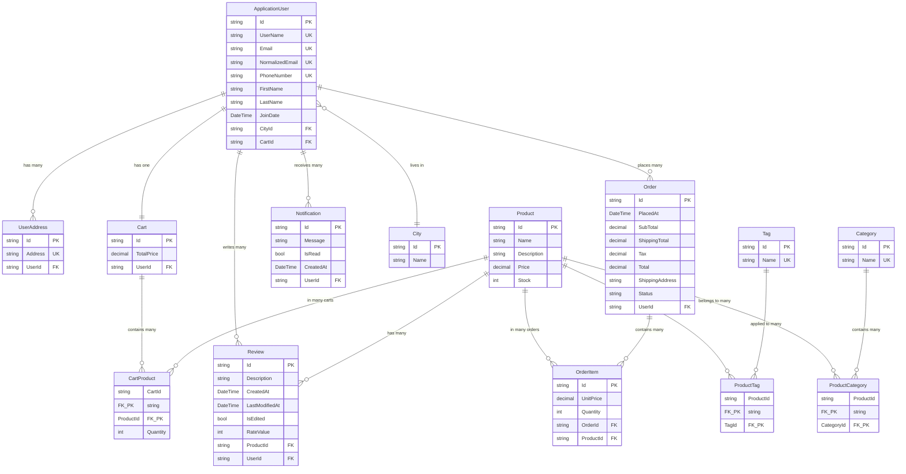

```mermaid
erDiagram
    ApplicationUser ||--o{ UserAddress : "has many"
    ApplicationUser ||--|| Cart : "has one"
    ApplicationUser ||--o{ Review : "writes many"
    ApplicationUser ||--o{ Order : "places many"
    ApplicationUser ||--o{ Notification : "receives many"
    ApplicationUser }o--|| City : "lives in"
    
    Cart ||--o{ CartProduct : "contains many"
    Product ||--o{ CartProduct : "in many carts"
    
    Product ||--o{ ProductTag : "has many"
    Tag ||--o{ ProductTag : "applied to many"
    
    Product ||--o{ ProductCategory : "belongs to many"
    Category ||--o{ ProductCategory : "contains many"
    
    Product ||--o{ Review : "has many"
    Product ||--o{ OrderItem : "in many orders"
    
    Order ||--o{ OrderItem : "contains many"
    
    ApplicationUser {
        string Id PK
        string UserName UK
        string Email UK
        string NormalizedEmail UK
        string PhoneNumber UK
        string FirstName
        string LastName
        DateTime JoinDate
        string CityId FK
        string CartId FK
    }
    
    City {
        string Id PK
        string Name
    }
    
    UserAddress {
        string Id PK
        string Address UK
        string UserId FK
    }
    
    Cart {
        string Id PK
        decimal TotalPrice
        string UserId FK
    }
    
    Product {
        string Id PK
        string Name
        string Description
        decimal Price
        int Stock
    }
    
    CartProduct {
        string CartId FK_PK
        string ProductId FK_PK
        int Quantity
    }
    
    Tag {
        string Id PK
        string Name UK
    }
    
    ProductTag {
        string ProductId FK_PK
        string TagId FK_PK
    }
    
    Category {
        string Id PK
        string Name UK
    }
    
    ProductCategory {
        string ProductId FK_PK
        string CategoryId FK_PK
    }
    
    Review {
        string Id PK
        string Description
        DateTime CreatedAt
        DateTime LastModifiedAt
        bool IsEdited
        int RateValue
        string ProductId FK
        string UserId FK
    }
    
    Order {
        string Id PK
        DateTime PlacedAt
        decimal SubTotal
        decimal ShippingTotal
        decimal Tax
        decimal Total
        string ShippingAddress
        string Status
        string UserId FK
    }
    
    OrderItem {
        string Id PK
        decimal UnitPrice
        int Quantity
        string OrderId FK
        string ProductId FK
    }
    
    Notification {
        string Id PK
        string Message
        bool IsRead
        DateTime CreatedAt
        string UserId FK
    }
```